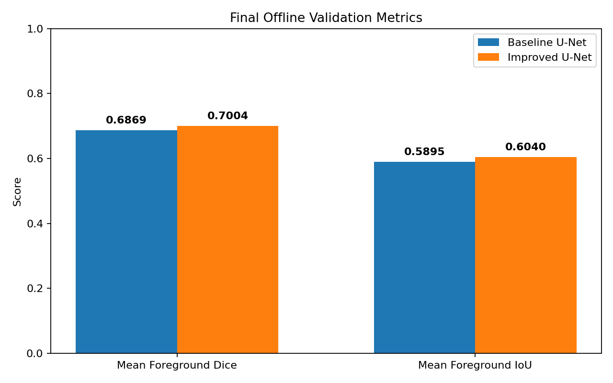
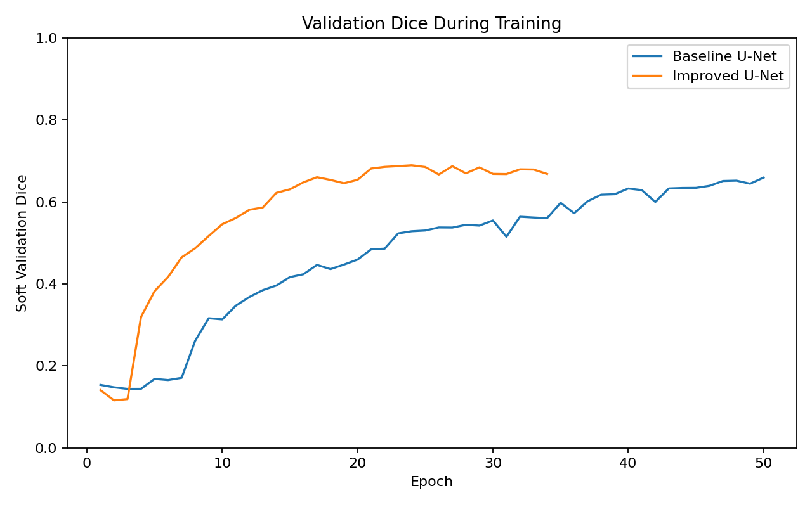

# Breast Ultrasound Lesion Segmentation with U-Net

A reproducible, leakage-free comparison of **Baseline** and **Improved U-Net** pipelines for breast-lesion segmentation on the **BUSI (Breast Ultrasound Images) dataset**.

This project emphasizes not only segmentation performance, but also **fair experimental comparison, deterministic validation, reproducibility, and methodological correctness**.

---

## Key Results

Both models were evaluated on the **exact same 130-image validation cohort** using the same prediction threshold and the same canonical offline metric definitions.

| Model | Mean Foreground Dice | Mean Foreground IoU |
|---|---:|---:|
| Baseline U-Net | 0.6869 | 0.5895 |
| **Improved U-Net** | **0.7004** | **0.6040** |
| **Improvement** | **+1.35 pp** | **+1.45 pp** |

The Improved U-Net achieved a modest but consistent improvement under the final standardized evaluation protocol.



---

## Tech Stack

**Python · TensorFlow / Keras · NumPy · OpenCV · scikit-learn · Matplotlib · Google Colab · Git · GitHub**

Core areas demonstrated in this project:

- Deep learning for semantic segmentation
- Medical-image preprocessing
- U-Net architecture design
- Custom segmentation losses and metrics
- Data augmentation
- Reproducible experiment design
- Target-leakage detection and correction
- Best-checkpoint evaluation
- Git-based experiment versioning

---

## Quick Links

| Resource | Link |
|---|---|
| Baseline U-Net Notebook | [Open notebook](01-baseline-busi-unet/notebook/baseline_busi_unet.ipynb) |
| Improved U-Net Notebook | [Open notebook](02-improved-busi-unet/notebook/improved_busi_unet.ipynb) |
| Final Model Comparison | [View comparison](comparison/tables/metrics_comparison.md) |
| Fair Comparison Contract | [View contract](comparison/tables/fair_comparison_contract.md) |
| Comparison Manifest | [View manifest](comparison/comparison_manifest.json) |
| Trained Models Archive | [Google Drive](https://drive.google.com/file/d/11eYIN_sAzJklZiPeKr5EngA2bH6aebyu/view?usp=sharing) |
| BUSI Dataset Mirror | [Google Drive](https://drive.google.com/file/d/1Pl22yxAccHBUfcBCAgMIK1XesDES-Ytl/view?usp=sharing) |
| Original BUSI Publication | [DOI: 10.1016/j.dib.2019.104863](https://doi.org/10.1016/j.dib.2019.104863) |

> The Google Drive BUSI file is provided only as a convenience mirror for reproducibility.
> Please cite the original BUSI publication listed in the References section.

---

## Project Highlights

This repository provides an end-to-end segmentation workflow with particular emphasis on experimental reliability:

- Built two modular U-Net segmentation pipelines.
- Standardized both notebooks under a shared **Notebook Contract v1.0**.
- Used deterministic dataset ordering and a shared random seed.
- Evaluated both models on the exact same validation cases.
- Fingerprinted validation membership with SHA-256.
- Reloaded the exact best saved checkpoint before final evaluation.
- Used mean per-sample foreground Dice and IoU as canonical offline metrics.
- Restricted data augmentation to training data only.
- Removed ground-truth-dependent ROI preprocessing to eliminate target leakage.
- Preserved run metadata, training histories, validation manifests, figures, and comparison artifacts.

---

# 1. Project Overview

Breast-lesion segmentation from ultrasound images is a semantic segmentation task in which a model predicts the lesion region at the pixel level.

This repository compares two U-Net-based experimental configurations.

### Baseline U-Net

A smaller reference configuration using:

- 128 × 128 grayscale inputs
- Binary Cross-Entropy loss
- 0.15 dropout
- No data augmentation

### Improved U-Net

A wider configuration using:

- 192 × 192 grayscale inputs
- Wider encoder/decoder feature maps
- BCE + Dice loss
- 0.10 dropout
- Training-only augmentation

The Improved experiment therefore represents a **combined model and training-recipe change**, rather than an architecture-only ablation.

The objective is to evaluate whether this combined configuration improves segmentation performance while preserving a controlled and reproducible validation protocol.

---

# 2. Dataset

The project uses the **BUSI — Breast Ultrasound Images Dataset**.

Dataset composition:

| Class | Images |
|---|---:|
| Benign | 437 |
| Malignant | 210 |
| Normal | 133 |
| **Total** | **780** |

The final segmentation experiment uses the benign and malignant cases:

```text
437 benign
+ 210 malignant
--------------
647 experiment cases
```

The **133 normal cases are outside the scope of this lesion-segmentation experiment**.

The deterministic experiment split contains:

```text
Training:   517
Validation: 130
Total:      647
```

Both models use exactly the same validation cohort.

---

## Preprocessing

Images and masks are loaded independently.

For the final pipelines:

- Ultrasound images are loaded in grayscale.
- Complete images are resized to the target model resolution.
- Images are normalized to `[0, 1]`.
- Ground-truth masks are binarized.
- Images use linear interpolation during resizing.
- Masks use nearest-neighbor interpolation to preserve segmentation labels.
- Dataset file ordering is deterministic.
- Ground-truth masks are never used to determine an input crop or region of interest.

The last condition is particularly important because using target masks to construct the model input would introduce **target leakage**.

---

# 3. Experimental Design

The final experiments follow a shared **Notebook Contract v1.0**.

Shared experimental conditions include:

| Setting | Value |
|---|---|
| Experiment cases | 647 |
| Training cases before augmentation | 517 |
| Validation cases | 130 |
| Validation fraction | 20% |
| Random seed | 42 |
| Batch size | 8 |
| Maximum epochs | 50 |
| Initial learning rate | 1e-4 |
| Prediction threshold | 0.5 |
| Canonical Dice | Mean per-sample foreground Dice |
| Canonical IoU | Mean per-sample foreground IoU |

The validation membership is fingerprinted with:

```text
SHA-256:
e5c318a528dee5a335218114b5b1601b5dbae8276686d739126ea5d5c3a8344c
```

The identical fingerprint and stored validation case IDs verify that both final models were evaluated on the same 130 images.

---

# 4. Model Architectures

Both models follow the U-Net encoder-decoder pattern with skip connections and Batch Normalization.

The primary architectural changes in the Improved model are increased input resolution and wider feature maps.

| Configuration | Baseline U-Net | Improved U-Net |
|---|---:|---:|
| Input | 128 × 128 × 1 | 192 × 192 × 1 |
| Encoder filters | 24 → 48 → 96 → 192 | 32 → 64 → 128 → 256 |
| Bottleneck filters | 384 | 512 |
| Dropout | 0.15 | 0.10 |
| Output | 1-channel sigmoid mask | 1-channel sigmoid mask |

---

## Baseline U-Net

The Baseline model establishes the reference experiment.

```text
Input size:       128 × 128 × 1
Loss:             Binary Cross-Entropy
Dropout:          0.15
Batch size:       8
Maximum epochs:   50
Augmentation:     None
Training samples: 517
Validation:       130
```

Final accepted run:

```text
Epochs completed:               50
Best epoch:                     50
Best monitored soft val Dice:  0.6593

Offline mean foreground Dice:   0.6869
Offline mean foreground IoU:    0.5895
```

---

## Improved U-Net

The Improved experiment increases input resolution and network width, changes the optimization objective, and introduces light train-only augmentation.

```text
Input size:                    192 × 192 × 1
Loss:                          BCE + Dice
Dropout:                       0.10
Batch size:                    8
Maximum epochs:                50

Training before augmentation:  517
Generated augmented samples:   517
Training after augmentation:   1034
Validation:                    130
```

Training-only augmentation includes:

| Transformation | Configuration |
|---|---|
| Horizontal flip | probability 0.5 |
| Vertical flip | probability 0.5 |
| Rotation | probability 0.5, up to ±15° |
| Intensity adjustment | probability 0.5, factor 0.9–1.1 |

No augmentation is applied to validation data.

Final accepted run:

```text
Epochs completed:               34
Best epoch:                     24
Best monitored soft val Dice:  0.6893

Offline mean foreground Dice:   0.7004
Offline mean foreground IoU:    0.6040
```

---

# 5. Final Comparison

The canonical comparison is based on predictions generated by the **exact best saved checkpoint**, reloaded from disk after training.

| Metric | Baseline | Improved | Change |
|---|---:|---:|---:|
| Mean Foreground Dice | 0.6869 | **0.7004** | **+0.0135 / +1.35 pp** |
| Mean Foreground IoU | 0.5895 | **0.6040** | **+0.0145 / +1.45 pp** |
| Best monitored soft validation Dice | 0.6593 | **0.6893** | +0.0300 |
| Best epoch | 50 | 24 | — |
| Epochs completed | 50 | 34 | — |

The headline metrics are the **offline mean per-sample foreground Dice and IoU**.

The soft validation Dice recorded during training is retained as a training-monitor metric and is not used as the canonical final result.

---

## Validation Dice During Training



The Improved model reaches its best monitored validation Dice earlier, while the final offline evaluation is performed only after reloading the corresponding best checkpoint.

Training-loss curves are stored separately:

- [`comparison/baseline/training_loss.png`](comparison/baseline/training_loss.png)
- [`comparison/improved/training_loss.png`](comparison/improved/training_loss.png)

The two loss values are intentionally **not compared numerically across models**, because the models optimize different objectives:

```text
Baseline → Binary Cross-Entropy

Improved → Binary Cross-Entropy + Dice Loss
```

A direct comparison of their absolute training-loss values would therefore be misleading.

---

# 6. Methodological Integrity

A central part of this project was improving the reliability of the experimental pipeline.

During project refactoring, an earlier preprocessing implementation was identified in which the ground-truth segmentation mask influenced ROI selection.

That creates **target leakage**, because information from the answer is used to construct the model input.

The approach was removed completely.

The final preprocessing path is:

```text
Ultrasound image
      │
      ▼
Full-image resizing
      │
      ▼
Normalization
      │
      ▼
U-Net
      │
      ▼
Predicted segmentation mask
```

The ground-truth mask is used only as the supervised target for training and evaluation.

It is never used to determine the model input.

Earlier results produced using the leakage-prone preprocessing path are therefore intentionally excluded from the final reported results.

---

# 7. Reproducibility

## Validated Final-Run Environment

The accepted Baseline and Improved experiments were executed in Google Colab with the following validated runtime environment:

| Component | Version |
|---|---:|
| Python | 3.13.15 |
| TensorFlow | 2.20.0 |
| NumPy | 2.1.3 |
| OpenCV | 4.14.0 |
| scikit-learn | 1.6.1 |
| Matplotlib | 3.10.0 |
| gdown | 5.2.2 |

The root-level `requirements.txt` contains the installable Python package dependencies used by the project. Python itself is documented separately because it is the runtime interpreter rather than a package installed through `pip`.

The final accepted experiments were executed in **Google Colab**.

---

## Local Setup

Clone the repository:

```bash
git clone https://github.com/armin-datasci/breast-ultrasound-segmentation-unet.git
cd breast-ultrasound-segmentation-unet
```

Create an isolated environment:

### Windows

```powershell
py -m venv .venv
.venv\Scripts\Activate.ps1
python -m pip install --upgrade pip
pip install -r requirements.txt
```

### Linux / macOS

```bash
python3 -m venv .venv
source .venv/bin/activate
python -m pip install --upgrade pip
pip install -r requirements.txt
```

For reproducing the complete training runs, **Google Colab with GPU acceleration is recommended**.

---

## Notebook Execution

Both notebooks follow the same high-level contract:

```text
1. Runtime and Reproducibility
2. Dataset Download and Extraction
3. Dataset Validation
4. Project Source and Methodology Checks
5. Experiment Configuration
6. Preprocessing
7. Train / Validation Split
8. Training Data Preparation
9. Model Construction
10. Training
11. Best Checkpoint Evaluation
12. Results and Artifacts
13. Final Run Summary
```

### Baseline

Open:

```text
01-baseline-busi-unet/notebook/baseline_busi_unet.ipynb
```

Use a fresh Colab runtime and select:

```text
Runtime → Run all
```

### Improved

Use a separate fresh runtime and open:

```text
02-improved-busi-unet/notebook/improved_busi_unet.ipynb
```

Again select:

```text
Runtime → Run all
```

Both notebooks download the same public BUSI mirror and reconstruct the deterministic experiment split.

The final validation fingerprints should match.

---

## Generated Run Artifacts

Each accepted final run generates:

```text
best_model.keras
run_metadata.json
training_history.json
validation_split.json

figures/
├── training_loss.png
└── validation_metrics.png
```

Large `.keras` model binaries are intentionally excluded from Git.

The final Baseline and Improved trained models are provided together through the **Trained Models Archive** linked near the top of this README.

Machine-readable experiment metadata and final figures remain version controlled inside the `comparison/` directory.

---

## Regenerating the Comparison

The `comparison/` directory acts as the source of truth for the final cross-model comparison.

After installing the dependencies:

```bash
python comparison/generate_comparison.py
```

The generator validates the stored experiment metadata and regenerates the comparison tables and plots.

Expected headline result:

```text
Baseline Dice: 0.6869
Improved Dice: 0.7004
Delta:         +1.35 pp

Baseline IoU:  0.5895
Improved IoU:  0.6040
Delta:         +1.45 pp

Shared validation cohort: PASS
```

---

# 8. Repository Structure

```text
breast-ultrasound-segmentation-unet/
│
├── 01-baseline-busi-unet/
│   ├── notebook/
│   │   └── baseline_busi_unet.ipynb
│   │
│   ├── src/
│   │   ├── callbacks.py
│   │   ├── dataset_loader.py
│   │   ├── evaluation.py
│   │   ├── losses.py
│   │   ├── model.py
│   │   ├── train_pipeline.py
│   │   └── utils.py
│   │
│   └── figures/
│       ├── training_loss.png
│       └── validation_metrics.png
│
├── 02-improved-busi-unet/
│   ├── notebook/
│   │   └── improved_busi_unet.ipynb
│   │
│   ├── src/
│   │   ├── augmentation.py
│   │   ├── callbacks.py
│   │   ├── dataset_loader.py
│   │   ├── evaluation.py
│   │   ├── losses.py
│   │   ├── model.py
│   │   ├── preprocessing.py
│   │   ├── train_pipeline.py
│   │   └── utils.py
│   │
│   └── figures/
│       ├── training_loss.png
│       └── validation_metrics.png
│
├── comparison/
│   ├── baseline/
│   │   ├── run_metadata.json
│   │   ├── training_history.json
│   │   ├── validation_split.json
│   │   ├── training_loss.png
│   │   └── validation_metrics.png
│   │
│   ├── improved/
│   │   ├── run_metadata.json
│   │   ├── training_history.json
│   │   ├── validation_split.json
│   │   ├── training_loss.png
│   │   └── validation_metrics.png
│   │
│   ├── plots/
│   │   ├── dice_iou_comparison.png
│   │   └── validation_dice_comparison.png
│   │
│   ├── tables/
│   │   ├── fair_comparison_contract.md
│   │   ├── metrics_comparison.csv
│   │   └── metrics_comparison.md
│   │
│   ├── comparison_manifest.json
│   └── generate_comparison.py
│
├── requirements.txt
├── .gitignore
├── LICENSE
└── README.md
```

Trained `.keras` files are intentionally distributed outside the Git repository.

---

# 9. What This Project Demonstrates

### Modeling

- Encoder-decoder CNN architectures
- U-Net skip connections
- Binary semantic segmentation
- Custom segmentation loss
- Batch Normalization and dropout
- Data augmentation

### Data & Evaluation

- Ultrasound image/mask preprocessing
- Correct interpolation of segmentation masks
- Deterministic sample ordering
- Controlled train/validation splitting
- Per-sample foreground Dice and IoU
- Best-checkpoint evaluation

### Reproducibility

- Fixed random seed
- Shared notebook contract
- Validation-set fingerprinting
- Machine-readable run metadata
- Stored validation membership
- Reproducible comparison generation
- Version-controlled experiment artifacts

### Engineering Practice

- Modular Python source code
- Experiment separation
- Git-based development
- Artifact management
- Methodological leakage detection and correction
- Transparent reporting of experimental results

---

# 10. Limitations

This repository is a controlled academic and portfolio experiment rather than a clinical system.

Important limitations include:

- Evaluation is performed on a single public dataset.
- Only the 647 benign and malignant BUSI cases are included in the segmentation experiment.
- Final performance is measured on a held-out validation split rather than an independent external test dataset.
- Only one deterministic train/validation split is reported.
- Repeated-seed experiments and confidence intervals are not included.
- Cross-validation is not performed.
- Normal BUSI cases are outside the scope of this experiment.
- The observed improvement is modest and should not be interpreted as statistical significance.
- The Baseline and Improved experiments differ in several model and training components, so the gain cannot be attributed to one individual change.
- The models have not undergone clinical validation.

The repository is intended for **educational and research purposes only** and must not be interpreted as a clinical diagnostic system.

---

# 11. Project Origin

This repository is a refactored and reproducible portfolio implementation developed from a Bachelor's-level project on medical-image segmentation.

The final version places particular emphasis on:

- reproducibility,
- fair model comparison,
- leakage-free methodology,
- modular code,
- transparent result reporting.

---

# 12. References

### U-Net

Ronneberger, O., Fischer, P., & Brox, T. (2015).

**U-Net: Convolutional Networks for Biomedical Image Segmentation.**

arXiv:1505.04597

### BUSI Dataset

Al-Dhabyani, W., Gomaa, M., Khaled, H., & Fahmy, A.

**Dataset of Breast Ultrasound Images.**

*Data in Brief*, Volume 28, 104863.

DOI: `10.1016/j.dib.2019.104863`

---

## Final Takeaway

Under the same deterministic validation cohort and standardized offline evaluation protocol:

```text
Baseline U-Net
Dice = 0.6869
IoU  = 0.5895

        ↓

Improved U-Net
Dice = 0.7004
IoU  = 0.6040
```

The project therefore demonstrates not only a measurable improvement in segmentation performance, but also a **reproducible, leakage-free, and auditable workflow for comparing deep-learning experiments fairly**.